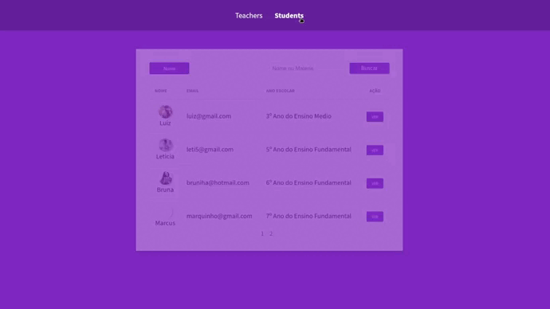

# Study Manager

<p>Sistema web de gerenciamento de tutores de estudo.</p>

<p>
  
  
  <a href="https://opensource.org/licenses/MIT">
    
  </a>
  <a href="https://github.com/JoseEnod/study-manager/commits/master">
    
  </a>
</p>

## Sobre o Study Manager

O Study Manager é uma aplicação web de gerenciamento de escolas, responsável pelo controle de professores e alunos. Desenvolvido como desafio do bootcamp [LaunchBase](https://rocketseat.com.br/launchbase) da [Rocketseat](https://rocketseat.com.br/). 

<p align="center">
  
</p>

<br>

## Funcionalidades

- [X] Criar, visualizar, editar e apagar professores e alunos.
- [X] Filtrar professores e alunos.
- [X] Paginação.
- [X] Páginas dinâmicas com Nunjucks.
- [X] Banco de dados PostgreSQL.

<br>

## Tecnologias

As seguintes tecnologias foram utilizadas no desenvolvimento do projeto:

- [HTML](https://devdocs.io/html/)
- [CSS](https://devdocs.io/css/)
- [Javascript](https://devdocs.io/javascript/)
- [Node](https://nodejs.org/en/)
- [Express](https://expressjs.com/)
- [Nunjucks](https://mozilla.github.io/nunjucks/)
- [PostgreSQL](https://www.postgresql.org/)

<br>

## Instalação e uso

Para rodar a aplicação, você precisa ter instalado em sua máquina o [Node](https://nodejs.org/en/) e o [Postgres](https://www.postgresql.org/).

Siga os passos abaixo:
```bash
# Abra um terminal e copie este repositório com o comando
$ git clone https://github.com/JoseEnod/study-manager.git
# ou use a opção de download.
    
# Entre na pasta com 
$ cd study-manager

# Instale as dependências
$ npm install
    

#Arquivos para importação do banco de dados ainda em criação
#Ainda não disponivel para download

# Crie e importe o banco de dados
$ psql -U postgres -c "CREATE DATABASE studymanager"
$ psql -U postgres -d studymanager <studymanager.sql
# Você também pode criar e importar manualmente o banco de dados usando o pgAdmin ou outro gerenciador de bancos.
    
# Conexão com o banco de dados: edite o arquivo db.js dentro da pasta src/config com o seu user e password do Postgres.

# Rode a aplicação
$ npm start
```

<br>

## Licença

Esse projeto está sob a licença MIT. Veja o arquivo [LICENSE](/LICENSE) para mais detalhes.

---

Feito com :purple_heart: by [José Enódio](https://github.com/JoseEnod)